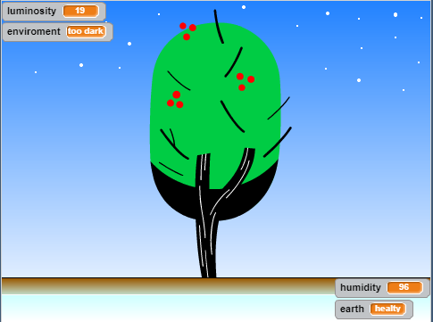
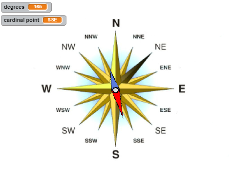

This [ScratchX](http://scratchx.org/) extension lets you control your [BBC micro:bit](https://microbit.org/) wirelessly using [Scratch programming blocks](https://scratch.mit.edu/). You can use this new blocks to design a whole new way of interacting with your Scratch projects.

Note: This ScratchX BBC micro:bit extension was developed to extend the operation system plataforms that [oficial extension](https://llk.github.io/microbit-extension/) supports, which only works with Mac OS X at this time.

This extension is known to work on Windows 10 + Chrome, Ubuntu 16.04 + Firefox and Raspberry PI 3 RASPBIAN + Chromium.

# Getting Started
Sorry, there is no installer yet, so we need some manual steps.
1. Download the [makecode-microbit-scratch-extension.hex](firmware/makecode-microbit-scratch-extension.hex) and copy it to the BBC micro:bit using a USB cable.
2. Get [Node.js](https://nodejs.org) if you don't have it yet. Some familiarity with this enviroment is necessary.
3. [Clone](https://github.com/jaafreitas/scratch-microbit-extension) or [download](https://github.com/jaafreitas/scratch-microbit-extension/archive/master.zip) this repository
4. Open a terminal, go to the repository and
```
npm install
```
5. Start the extension with
```
node index.js
```
6. Launch the BBC micro:bit extension in [English](http://scratchx.org/?url=https://jaafreitas.github.io/scratch-microbit-extension/scratch_microbit.js&lang=en) or [Portuguese](http://scratchx.org/?url=https://jaafreitas.github.io/scratch-microbit-extension/scratch_microbit.js&lang=pt-br)

# Examples
## [Monitor a plant using the analog input pins of a BBC micro:bit.](http://scratchx.org/?url=https://jaafreitas.github.io/scratch-microbit-extension/examples/GardenMonitoring.sbx)


## [Check your location using a compass and a BBC micro:bit.](http://scratchx.org/?url=https://jaafreitas.github.io/scratch-microbit-extension/examples/Compass.sbx)


# Technical stuff
* [firmware](firmware): information about the firmware development.
* [noble-uwp](https://github.com/jasongin/noble-uwp): library responsible for the bluetooth communication on Windows 10.
* [node-bbc-microbit](https://github.com/sandeepmistry/node-bbc-microbit): [API](https://github.com/sandeepmistry/node-bbc-microbit/blob/master/API.md) for controling a BBC micro:bit using Node.js
