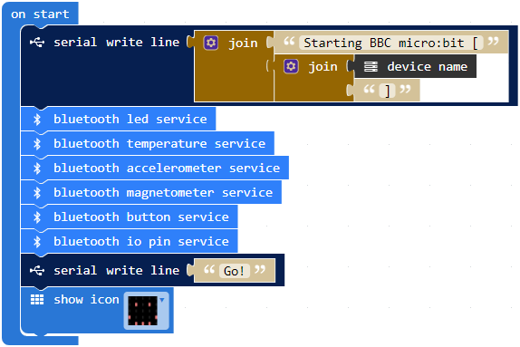

The [firmware](makecode-microbit-scratch-extension.hex) necessary to establish the Scratch and BBC micro:bit communication
was built using [https://makecode.microbit.org](https://makecode.microbit.org)

There is a [shared project avaliable here](https://makecode.microbit.org/_MaF8jJVdTDyo)

## JavaScript Blocks Editor

If you want to rebuilt the firmware, don't forget to enable "No Pairing Required: Anyone can connect via Bluetooth" in Project Settings.

## Javascript

You can also rebuild the firmware using the code [makecode-microbit-scratch-extension.js](makecode-microbit-scratch-extension.js) 
with [config.json](config.json) settings.

## armMBED

There is a complete development enviroment avaliable on [armMBED](https://os.mbed.com/compiler) 
where you can have total controle of the code used to generate the firmware.
